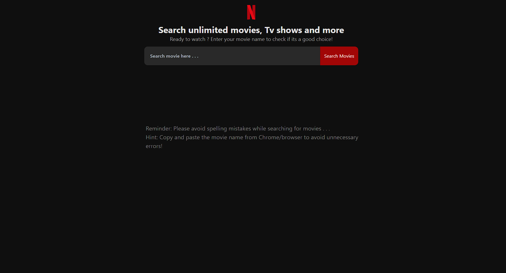
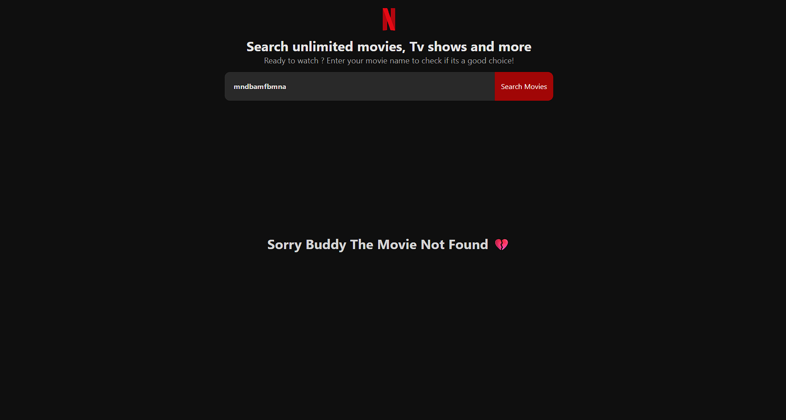
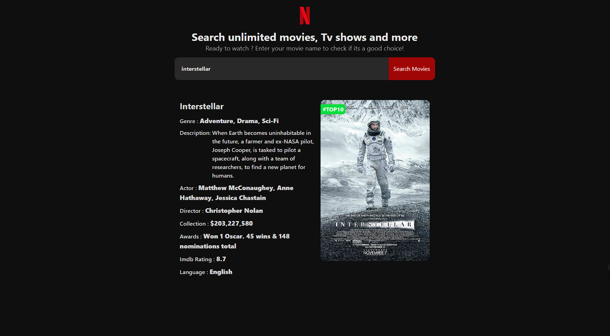

# Movie Search App

A responsive **Movie Search Application** built using **HTML, CSS, and JavaScript**.  
This project uses the **OMDb API** to fetch movie details dynamically based on user search.

Users can search for any movie and get information like poster, title, release year, genre, rating, and plot.

---

## Features

- Search movies by name
- Display movie poster
- Show IMDb rating
- Release year information
- Movie genre details
- Movie description
- Error handling for unavailable movies
- Clean modern UI
- Responsive design
- Dynamic API data fetching

---
### Screenshots





## Technologies Used

- HTML5
- CSS3
- JavaScript (ES6)
- Fetch API
- OMDb API

---

## Project Structure
```bash
Movie-Search-App-API/
├── images/
│ └── screenshot1.png
│ └── screenshot1.png
│ └── screenshot1.png
├── index.html
├── style.css
├── app.js
└── README.md
```
